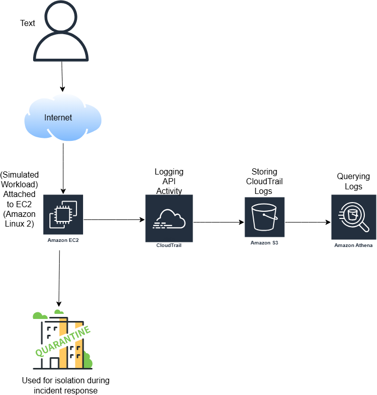

# AWS Free Tier Incident Response & Forensic Investigation Lab

This project simulates a cloud security incident and demonstrates detection, investigation, containment, and monitoring using AWS Free Tier services.

## Architecture Overview

Services Used:
- Amazon EC2 (t3.micro)
- AWS CloudTrail
- Amazon S3
- Amazon Athena
- Amazon CloudWatch
- AWS IAM

## Architecture Diagram

### Architecture Overview

- CloudTrail logs all API activity.
- Logs are stored in S3.
- Athena queries analyze suspicious behavior.
- Security Groups isolate compromised EC2 instances.

🔹 Phase 1 – Environment Setup

Launched an EC2 instance (t3.micro) within Free Tier limits

Attached a least-privilege IAM role following the principle of least privilege

Disabled detailed monitoring to reduce unnecessary cost

Configured a secure Security Group allowing only restricted inbound access

🔹 Phase 2 – Incident Simulation

To simulate attacker behavior, I intentionally performed the following actions:

Modified the Security Group to allow inbound access from 0.0.0.0/0

Created a new IAM user

Attached AdministratorAccess policy to simulate privilege escalation

Stopped and restarted the EC2 instance

These actions generated suspicious CloudTrail activity for investigation.

🔹 Phase 3 – Log Investigation

Enabled AWS CloudTrail to capture API activity

Configured log storage in Amazon S3

Created an Athena table to query CloudTrail logs

Executed SQL queries to extract CreateUser and other suspicious events

Built an event timeline to understand attacker behavior

See athena-queries.sql for full investigation queries.

🔹 Phase 4 – Containment

Created a quarantine Security Group

Removed all inbound and outbound rules

Detached the original Security Group from the instance

Isolated the EC2 instance while preserving logs and artifacts

Instead of terminating the instance, I isolated it to preserve forensic artifacts.

🔹 Phase 5 – Monitoring & Alerting

Created CloudWatch metric filters for suspicious API activity

Configured detection for ConsoleLogin failures

Configured detection for CreateUser events

Built CloudWatch alarms to trigger alerts

This demonstrates detection engineering and proactive monitoring design.

🔹 Skills Demonstrated

Cloud incident response workflows

AWS log analysis

Athena SQL investigation

IAM privilege escalation detection

Network isolation strategy

Detection engineering using CloudWatch

Cost-aware cloud security design

### Screenshots

See the full investigation queries here:  
👉 [Athena Investigation Queries](athena-queries.sql)

See lessons-learned.md for reflections and future improvements.

## Future Improvements

In a production environment, I would:
- Centralize logs using AWS Organizations
- Automate isolation using EventBridge + Lambda
- Enable GuardDuty for threat intelligence
- Implement cross-account logging architecture

